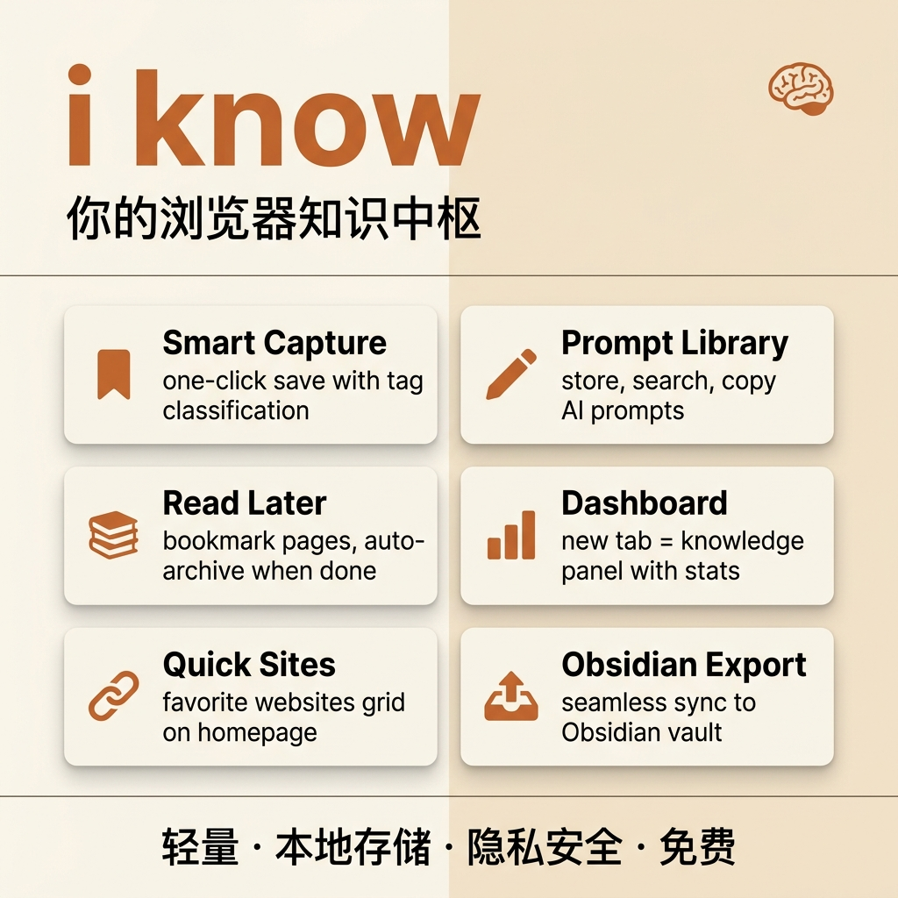

<p align="center">
  
</p>

<h1 align="center">i know</h1>
<p align="center"><strong>你的浏览器知识中枢</strong></p>
<p align="center">
  <em>采集 · 分类 · 管理 · 导出 — 让碎片知识不再流失</em>
</p>

<p align="center">
  
</p>

---

## ✨ 功能亮点

### 🔖 智能采集
- **浮窗一键保存**：点击浮窗即可保存当前页面，自动弹出分类选择（链接 / 提示词 / Skill / 文章 / 截图）
- **划选即存**：选中文字后弹出快捷工具栏，一键保存或复制
- **右键菜单**：支持保存选中文本、图片、页面，或标记为「稍后阅读」
- **自定义标签**：保存时可添加 `#自定义标签`，自动生成对应筛选按钮

### ✏️ 提示词管理
- 内置提示词库，支持 **图片 / 文章 / 通用** 三种分类
- 浮窗内直接搜索和复制提示词，无需离开当前页面
- 快速添加新提示词，支持 `#标签` 自动提取

### 📚 稍后阅读 & 收藏夹
- 一键存入「稍后阅读」，标记已读后自动归档
- 重要内容加星收藏，随时回看
- Archive 支持搜索和一键清空

### 📊 知识仪表盘
- 新标签页即知识面板，展示标签页统计、知识条目数、待读数
- **常用网站**快速访问区，支持自由添加 / 编辑 / 删除
- 知识库动态筛选，内置类型 + 自定义标签一目了然

### 📤 Obsidian 集成
- 通过 [Local REST API](https://github.com/coddingtonbear/obsidian-local-rest-api) 插件，静默追加到 Obsidian 收集箱
- 侧边栏支持多选批量导出
- 首次使用提供配置引导，零门槛上手
- 格式：`- [ ] [标题](URL) · 来源 · 关键词 · 时间`

---

## 📥 安装

### 方式一：开发者模式（推荐）

1. 下载本仓库：`git clone https://github.com/sammyteng/i-know-extension.git`
2. 打开 Chrome，访问 `chrome://extensions/`
3. 右上角开启 **开发者模式**
4. 点击 **加载已解压的扩展程序**，选择项目文件夹
5. 完成 ✅ 新标签页即为 i know 面板

### 方式二：直接下载

1. 下载 [最新 Release](https://github.com/sammyteng/i-know-extension/releases) 的 zip 文件
2. 解压后按上述步骤加载

---

## 🛠 技术栈

| 组件 | 技术 |
|------|------|
| 前端 | 原生 HTML / CSS / JavaScript（零框架） |
| 存储 | `chrome.storage.local` |
| API | Chrome Extensions Manifest V3 |
| 集成 | Obsidian Local REST API |

**零依赖**，无需 npm install，无需构建，开箱即用。

---

## 📁 项目结构

```
extension/
├── manifest.json          # 扩展配置
├── index.html             # 新标签页（主面板）
├── sidepanel.html         # 侧边面板
├── background.js          # Service Worker
├── content.js             # 浮窗 & 页面交互
├── content-widget.css     # 浮窗样式
├── js/
│   ├── app.js             # 主面板逻辑
│   ├── storage.js         # 数据持久化
│   ├── tabs.js            # 标签页管理
│   ├── obsidian.js        # Obsidian 集成
│   └── sidepanel.js       # 侧边面板逻辑
├── styles/
│   ├── main.css           # 主面板样式
│   ├── shared.css         # 共享变量
│   └── sidepanel.css      # 侧边面板样式
└── icons/                 # 扩展图标
```

---

## 🔐 隐私

- **所有数据 100% 本地存储**，不上传任何服务器
- 仅在用户主动使用 Obsidian 导出时连接 `localhost`
- 无需注册、无需登录、无需同步账号
- 未使用任何第三方分析或追踪工具

---

## 📝 更新日志

### v1.0.0（2026-04-27）
- 🎉 首次发布
- 浮窗采集 + 分类标签选择
- 提示词管理（图片/文章/通用）
- 稍后阅读 & 收藏夹
- 知识仪表盘 + 常用网站
- Obsidian 无缝集成
- 自定义标签动态筛选

---

## 🙏 致谢

本项目基于 [**tab-out**](https://github.com/zarazhangrui/tab-out) 改造开发，感谢原作者 [@zarazhangrui](https://github.com/zarazhangrui) 提供的优秀标签管理基础架构。

> tab-out — *Keep tabs on your tabs. Turn your "New tabs" page into a mission control.*

在 tab-out 的标签页管理和新标签页仪表盘基础上，i know 扩展了知识采集、提示词管理、分类标签、Obsidian 集成等能力，将其从标签管理工具进化为完整的浏览器知识中枢。

---

## 📜 License

MIT © [sammyteng](https://github.com/sammyteng)

基于 [tab-out](https://github.com/zarazhangrui/tab-out)（MIT License © zarazhangrui）
